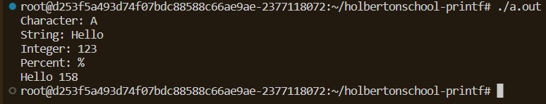

# Holberton School - Project Printf

## Description

This project recreates a simplified version of the printf standard function in C. It supports multiple format specifiers and relies solely on the write() system call.

## Requirements

Environment and tools used:

- Ubuntu 20.04 LTS
- gcc 9.3.0 (or equivalent version)
- git
- Compilation with mandatory flags:

  -Wall -Werror -Wextra -pedantic
- Compliance with standards Betty

## Supported Specifiers

| Specifier | Description |
|----------|-------------|
| %c       | Print a character |
| %s       | Print a string |
| %d / %i  | Print a signed integer |
| %%       | Print the `%` character |

## Compilation

To compile all the files and generate the executable, use:

```bash
gcc -Wall -Werror -Wextra -pedantic *.c -o printf
```

## Example :

```c
int main(void)
{
    _printf("Character: %c\n", 'A');
    _printf("String: %s\n", "Hello");
    _printf("Integer: %d\n", 123);
    _printf("Percent: %%\n");
    _printf("Hell%c %d", 'o', 158);

    return 0;
}
```

## Expected result (STDOUT)



## Test :

```c
_printf("Test char: %c\n", 'X');
_printf("Test string: %s\n", "Bonjour");
_printf("Test integer: %d\n", -42);
_printf("Test percent: %%\n");
_printf("Mixed: %s %c %d %%\n", "Test", 'A', 100);
```

## Man Page

A custom man page is provided.
To access it, use the command:

man ./man_3_printf

## Flowchart


## Authors

- **Bryan MARTEL** — [GitHub](https://github.com/Itsuki732)
- **Maxime RÉGNIER** — [GitHub](https://github.com/Maxime-Regnier)
